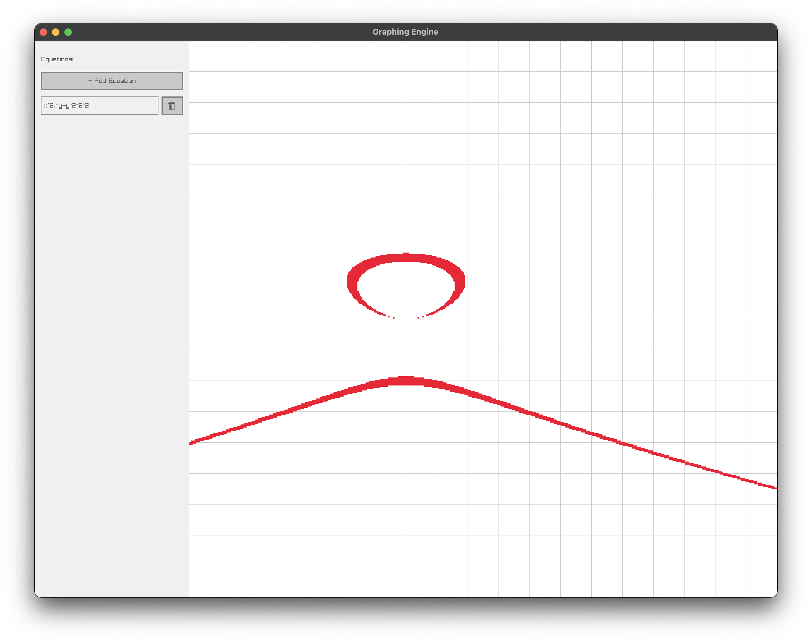
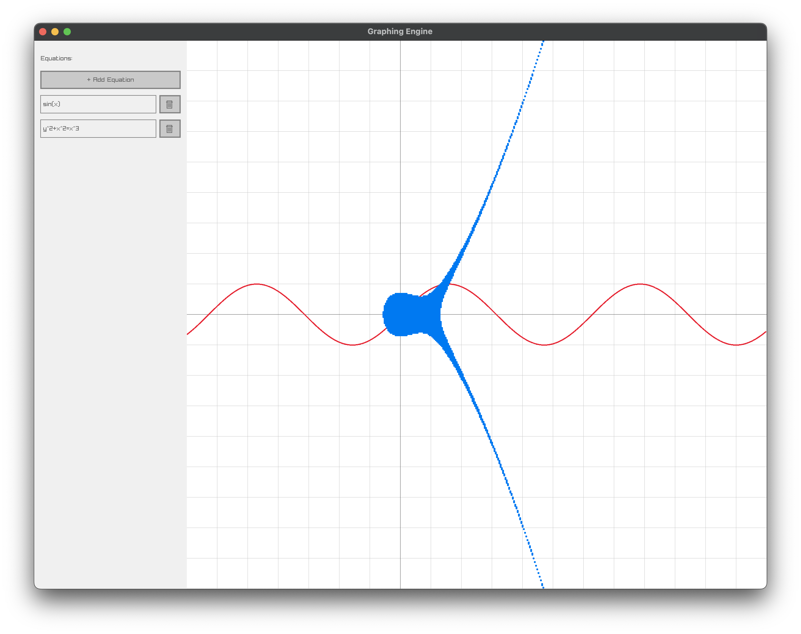
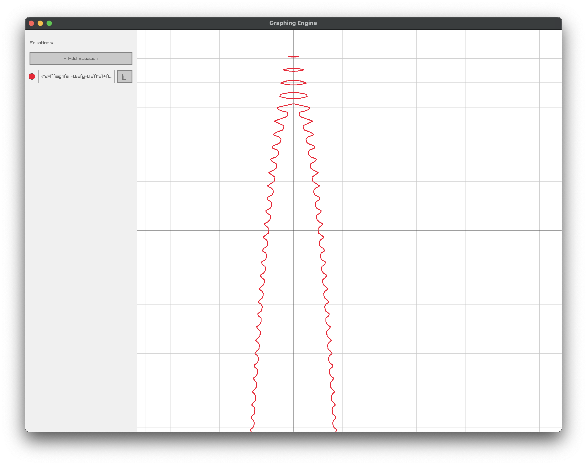

# Kade's graphing calculator

i woke up this morning and i wanted to build a desmos clone, which is this project

This tool implements a fun set of tools to parse and render equations:
- tokenizer -> parser -> abstract syntax tree
- marching squares for rendering
- internal variable definitions (eg. `x_1 =3` can be used in other equations)

TBD:
- polar graphs
- parametric graphs
- inequalities
- animated parameters

## Example photos (later photos are more recent)

These 2 are before the marching squares algorithm was implemented:

vs after: 

